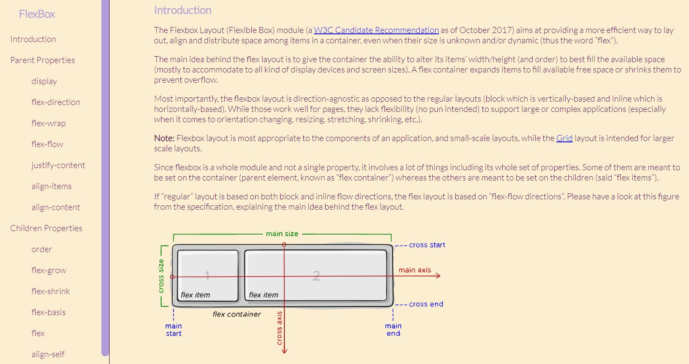

# technical-documentation

	English | <a href="https://github.com/samlatavares/technical-documentation/blob/master/translations/pt-br/README.md">Português</a>

</img>

## What is this project?
FlexBox Technical Documentation developed for the FreeCodeCamp's Responsive Web Design Certification.

## Working with this project
The file "index" contains all page's code. You just need to open it using a text editor.

To clone the project:
- git clone https://github.com/samlatavares/technical-documentation

If you want to see this project's result you can access it <a href="https://samlatavares.github.io/technical-documentation/" target="_blank">here</a>.
